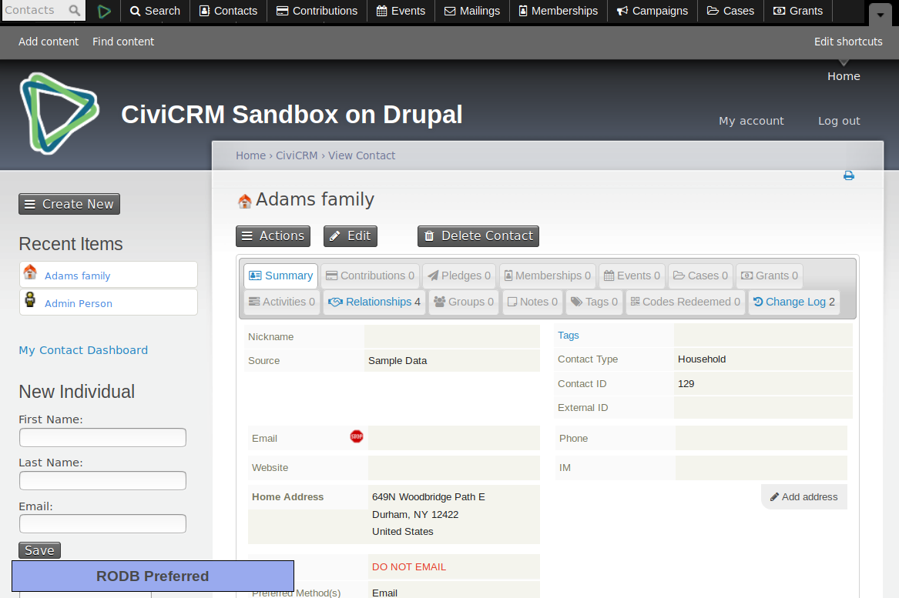

# CiviCRM Replay-on-Write Debug Utility (rpowdbg)

`rpowdbg` displays a debug panel as you browse a CivCRM site. By default, it
indicates that you are in RODB mode -- which means that any data displayed
will come from the read-only database (RODB).

Suppose you make an edit -- such as changing the household name from "Adams
family" to "Adams family values". The edit will cause a redirect to the
read-write database (RWDB), and the panel expands:

This panel reveals a few key pieces of information:

* There is a cookie. As long as this cookie remains active, the user's
  requests will be directed to RWDB.
* The cookie will expire (in some number seconds).
* At the moment that it reconnected, there was a *buffer* -- a list of
  queries which would need to be executed on the RWDB.  The last query in
  the buffer is usually *the cause* of the reconnection.  To wit: when the
  user edit's the contact's name, it leads to a query `UPDATE
  civicrm_contact ...`; to service this query, we switched from RODB to
  RWDB.

The extension is licensed under [AGPL-3.0](LICENSE.txt).

## Requirements

* PHP v5.4+
* CiviCRM 5.10+ (?)
* rpow

## Installation

This extension is bundled with `rpow`.  After installing `rpow`, simply
enable `rpowdbg`.  The new panel will appear automatically.
